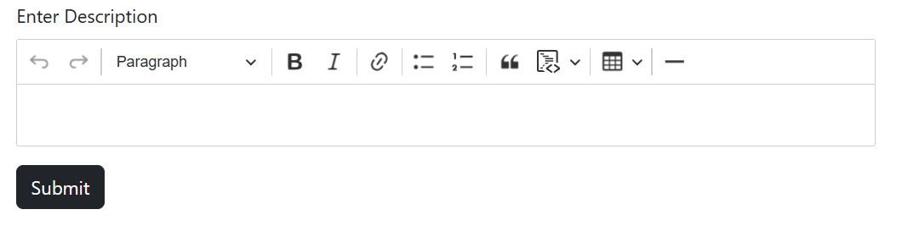

<p align="center"><a href="https://laravel.com" target="_blank"></a></p>

# Markdown-CKEditor-Laravel-10

CKEditor is a WYSIWYG rich text editor which enables writing content directly inside of web pages or online applications.
<br />


Important Links : 
- [HTML-OUTPUT CKEditor Repository](https://github.com/suraj-repositories/Html-CKEditor-laravel-10)
- [Ck Editor 5 download/cdn/npm](https://ckeditor.com/ckeditor-5/download/#zip)
- [Official Website](https://ckeditor.com/)

### Screenshot 

<div align="center">

</div>

## Steps 

### Using CDN
1. When you are using CDN you need to add the following stylesheet in your html head section
```html
    <link rel="stylesheet" href="https://cdn.ckeditor.com/ckeditor5/42.0.1/ckeditor5.css" />
```
2. Add the javascript needed (Make sure to paste the code in html or php files not on js file)
```html
<script type="importmap">
        { 
            "imports": {
                "ckeditor5": "https://cdn.ckeditor.com/ckeditor5/42.0.1/ckeditor5.js",
                "ckeditor5/": "https://cdn.ckeditor.com/ckeditor5/42.0.1/"
            }
        }
</script>
```
3. The next step is to add needed plugins and customize your ckeditor according to your need
    <br>The basic One : 
```html
 <script type="module">
    import {
        ClassicEditor,
        Markdown,
        Bold,
        Italic,
        Link,
        Paragraph,
        Heading,
        BlockQuote,
        CodeBlock,
        List,
        Table,
        TableToolbar,
        HorizontalLine,
        Essentials,
        Undo
    } from 'ckeditor5';

    let ckEditors = document.querySelectorAll(".ckeditor");

    ckEditors.forEach((editor) => {
        ClassicEditor
            .create(editor, {
                plugins: [
                    Essentials,
                    Markdown,
                    Bold,
                    Italic,
                    Link,
                    Paragraph,
                    Heading,
                    BlockQuote,
                    CodeBlock,
                    List,
                    Table,
                    TableToolbar,
                    HorizontalLine,
                    Undo
                ],
                toolbar: {
                    items: [
                        'undo', 'redo', '|',
                        'heading', '|',
                        'bold', 'italic', '|',
                        'link', '|',
                        'bulletedList', 'numberedList', '|',
                        'blockQuote', 'codeBlock', '|',
                        'insertTable', '|',
                        'horizontalLine'
                    ]

                }
            })
            .then(editor => {
                window.editor = editor;
            })
            .catch(error => {
                console.error(error);
            });
    });
</script>


        
```

4. After this you are able to use the ckeditor - To use this 
    - Where-ever you want to use ckeditor : you need to add a class `ckeditor` on the element
```html
<textarea class="form-control ckeditor" name="description" id="editor" cols="30" rows="5"></textarea>
```

5. Tip : It will shows a logo at bottom-right corner : To remove that logo use the collowing code 
```html
<style>
    .ck-powered-by {
        display: none !important;
    }
</style>
```

6. When showing the output on frontend use the following patter to show it otherwise it will show the plain html
```php
 {!! Str::markdown($todo->description) !!}
```
**Note:** This will convert the markdown into html, some advance components like table and lists may not visible if you don't apply proper css for them<br>
**Tip:** Apply css for `<table>` tag and there childs you can write your own css in css file and the styles will automatically applied at the time of output.


### Using downloaded files (ZIP)
1. download the zip from website : - [Ck Editor 5 download](https://ckeditor.com/ckeditor-5/download/#zip) or you can also use the already downloaded file from `public\assets\ckeditor5`

2. On the downloaded zip file -> extract it -> find the `ckeditor5` directory -> paste the ckeditor directory on a location from which the js/css file will accessable
    - In my case i put the `ckeditor5` directory like `public\assets\ckeditor5` 
    - and now the `ckeditor5` directory is accessable in your project

3. For stylesheet use the following code : 
```html
<link rel="stylesheet" href="{{ asset('assets/ckeditor5/ckeditor5.css') }}" />
```

4. Add the javascript needed (Make sure to paste the code in html or php files not on js file)
```html
<script type="importmap">
    { 
        "imports": {
            "ckeditor5": "{{ asset('assets/ckeditor5/ckeditor5.js') }}",
            "ckeditor5/": "{{ asset('assets/ckeditor5/') }}"
        }
    }
</script>
```
5. for next steps follow the steps `3 to 6` of `Using CDN` ⬆️

## Files where i made changes

- resources\views\local-example.blade.php
- resources\views\cdn-example.blade.php
- routes\web.php
- app\Http\Controllers\EditorController.php
- added dir : public\assets\ckeditor5

# Installation - 
If you want to download and use this project as reference; here is the steps : 
1. download and extract the zip
2. make sure you have `php 8.1+` and `Laravel 10+` installed on your PC
3. create mysql database named `ck_editor_test`
4. on project root directory run commands : *INTERNET IS REQUIRED*
    - `composer intsall`
    - `php artisan migrate`
    - `php artisan serve`
5. Visit on URL [http://127.0.0.1:8000/](http://127.0.0.1:8000/)

<br />
<br />
<p align="center">⭐️ Star my repositories if you find it helpful.</p>
<br />